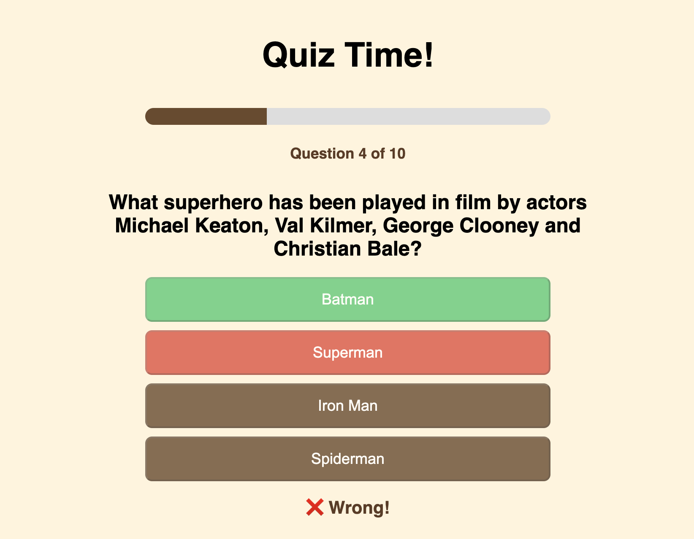
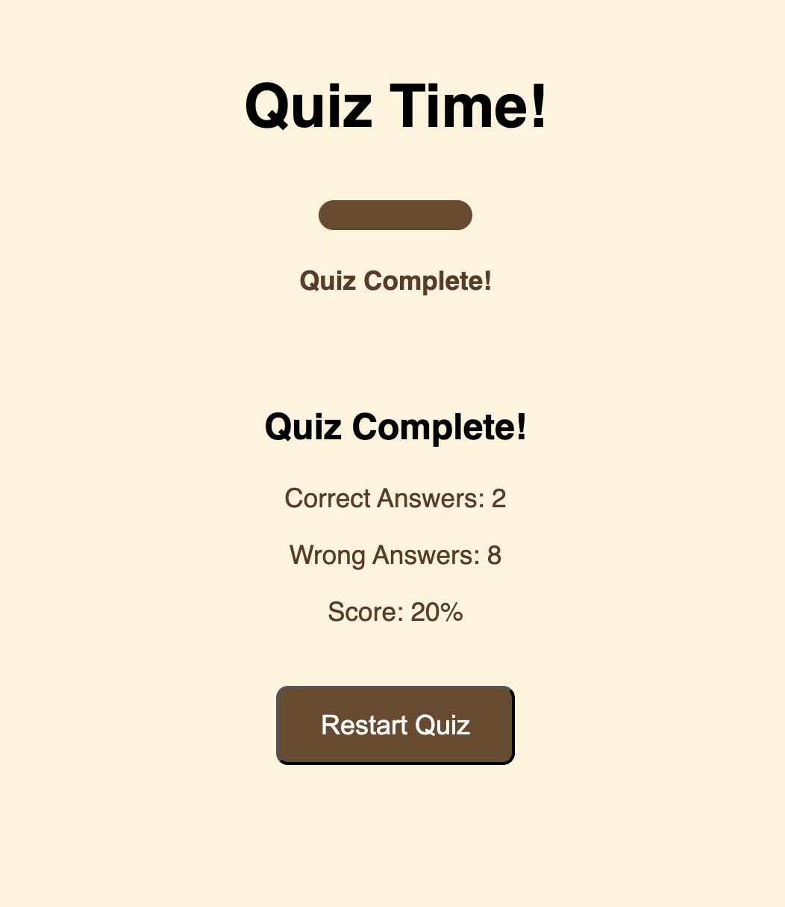
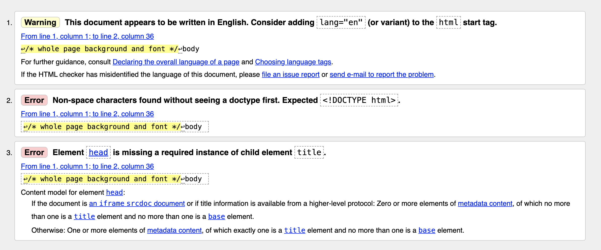

# Project Brief
The online quiz would be a website where users can answer a series of questions and
receive feedback or graded on their performance. The quiz would have questions with
multiple-choice options, and navigation buttons (like ‘Next’ and ‘Submit’). Each question
could be displayed on its own page or section. The quiz could feature different types of
questions (like multiple-choice, true/false, or fill-in-the-blank).
The questions should be loaded at random every time. The online quiz demonstrates
your understanding and application of JavaScript, along with HTML and CSS for
structure and styling. At the end of the quiz, users could receive a summary of their
performance, including the number of correct answers, total score, and possibly
explanations for the correct answers.
## Online Quiz
My online quiz is based on film trivia. Giving 10 random questions each time you play and gives a score at the end.

With help from Open Trivia DB and using this link: https://opentdb.com/api_config.php , I was able to generate an API to use for my quiz.
# Tech Used
I used a mixture of styles.css, index.html and main.js. I also included using an API Request as preivously mentions in the above section: _Online Quiz_. All with features as shown/explained in the _Features_ section below.
# Features

This is the first screen that is shown, highlighted in my code as the index.html. On this screen, it shows an explaination of the game with an active _submit_ button to take you to the next page. 

This is an example of what ahppens when an incorrect answer is selected. The UX shows what is the correct answer and the progess bar moves up. Just out of shot is the _next_ button which takes you to the next question. 

This is an example of what happens when a correct answer is selected. 

At the end of the quiz, you are shown your results as a percentage with how many were correct and incorrect. At the bottom of the page you may press the _Restart Quiz_ button and start again with different questions. 

# Testing

#### To help structure and use a Readme file, i used https://dillinger.io/ - an online markdown example.
#### To help with my testing I used an HTML checker.
https://validator.w3.org/nu/#textarea

In my testing, I have taken screenshots of each main page of my code to see if there are any errors. In this case, for my index.html file. There are no errors.

I did the same with my styles page on css but there were a few issues. I fix these issues by condensing the body headers and deleting a start button function as the second overrides the first. 

# Future Improvements
I would like to acheive a function that allows for a category choice, with a difficulty setting. 

I would also like to improve my understanding of the _russian doll_ method in an effort to simplify my work into different folders. I did attemp this but, had difficulty with making my code work with href statements. 